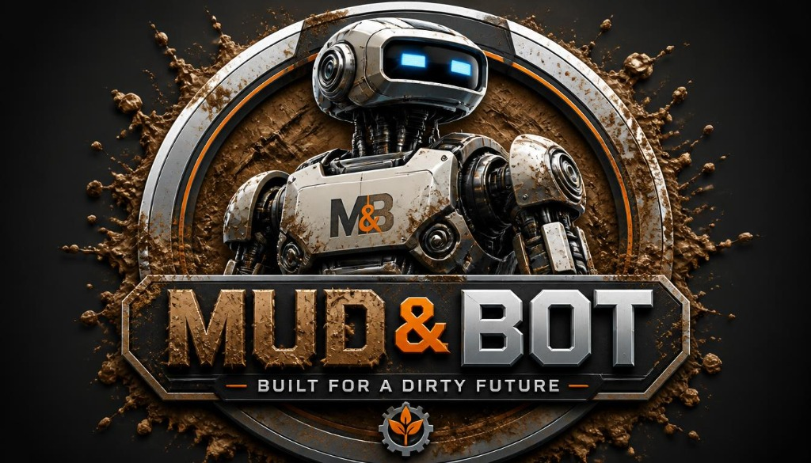

# MUD & BOT — "BUILT FOR A DIRTY FUTURE"

<div align="center">
  
  <br />
  <strong>An avant-garde backyard robotics laboratory fusing CNC woodworking, high-strain 3D printing, and embedded edge AI.</strong>
  <br /><br />
</div>

---

## 🦾 About Mud & Bot

The future of robotics will not unfold in sterile research labs. It will happen in rain-soaked backyards, vegetable patches, rough quarries, and off-grid homesteads.

**MUD & BOT** creates rugged, field-repairable autonomous machines designed to thrive in dirt, loam, and wet clay without clinical clean rooms or expensive proprietary titanium components.

---

## 🛠️ Tech Stack & Architecture

- **Core Framework:** React 19 + TypeScript + Vite 8
- **3D Graphics & Physics:** Three.js + React Three Fiber (`@react-three/fiber`, `@react-three/drei`)
- **Tactile Audio:** Native Web Audio API procedural sound synthesizer (hydraulic air releases, servo relay snaps, sub-bass impulses)
- **Styling & Aesthetics:** Tailwind CSS with custom Void/Mud/Amber/Cyan tokens and cyber chamfer clipping
- **Animations:** Framer Motion + Canvas Confetti
- **Icons:** Lucide React

---

## ⚡ Key Features

1. **Zero-G Workshop Disruption (Hero Section):**
   - Central 3D robot bust with glowing cyan digital eyes and battle-worn steel armor splattered with mud.
   - 30+ floating zero-gravity debris items (birch gears, 3D printed PETG brackets, brass bolts, raw pine chunks, and wet clay blobs).
   - Mouse gravitational repulsion and click-triggered zero-G disruption shockwaves.
   - Scanline HUD with real-time FPS counter, local time with milliseconds, and simulated gyroscope angles.

2. **Exploded View Architecture:**
   - Interactive 3D layer deconstruction (0% to 100% separation slider).
   - **Layer 1: Organic Wood Backbone:** CNC birch spine absorbing shock impulses 8.4x better than brittle carbon fiber.
   - **Layer 2: Functional High-Strain 3D Prints:** Sacrificial PETG crumple links and TPU flexible continuous tracks.
   - **Layer 3: Edge AI Nervous System:** Offline ESP32-S3 dual-core microcontroller running sub-watt neural models.
   - Interactive hotspot micro-drawers comparing real-world backyard durability vs. commercial aerospace drones.

3. **The Project Hangar Bento Grid:**
   - 3D parallax tilt cards reacting to mouse coordinates.
   - Web Audio hydraulic whoosh sound effects on hover.
   - Live SVG real-time torque and speed oscilloscopes.
   - Interactive emotive mascot OLED face cycler (*Happy, Alert, Muddy, Sleeping*).
   - Instant BOM inspection modals.

4. **Interactive DIY Blueprint Generator:**
   - Terminal configurator to select base wood stock, locomotion system, compute brain, and mission profile.
   - Dynamic calculations for dry weight, print hours, BOM cost, and durability score.
   - Live ASCII wireframe schematic visualizer.
   - One-click export for **Download BOM (.JSON)** and **Export Cutsheet (.MD)**.

5. **The Dirt Doctrine & Telemetry Footer:**
   - The four core engineering principles of backyard robotics.
   - Rotating stamped gear seal featuring the official insignia.
   - Encrypted Field Dispatch newsletter terminal with simulated shell output.

---

## 🚀 Local Development

```bash
# Clone the repository
git clone https://github.com/tigatosra/mudbot.git

# Navigate into directory
cd mudbot

# Install dependencies
npm install

# Start development server
npm run dev
```

---

## 📜 License & Credits

All designs are published under open hardware principles. Built with sawdust, molten PETG, and AI weights in the backyard lab.
